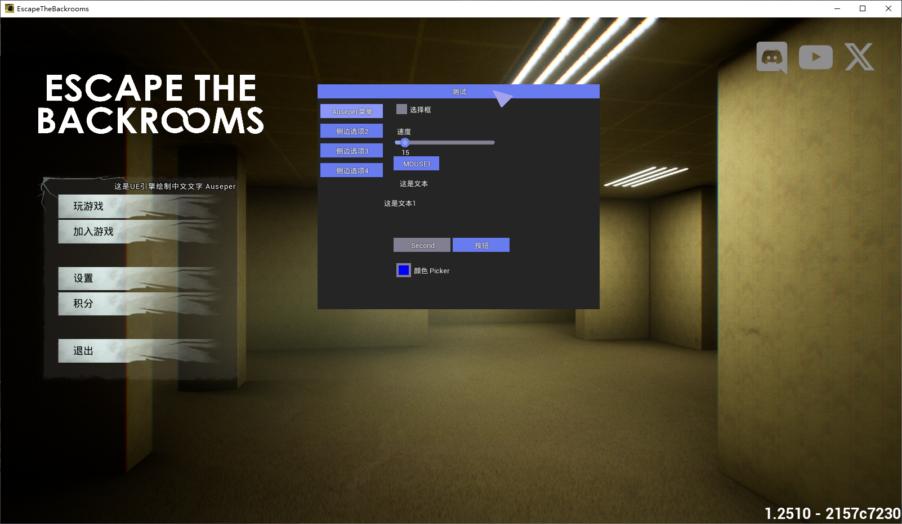

# ue4-canvas-gui-Chinese-Version

### 原仓库：https://github.com/MaddyOff/ue4-canvas-gui 此版本使其能显示中文而不乱码

## 效果图:




## 食用方法:

在你代码中包含 **ZeroGUI.h**

找到你游戏的 **UCanvas** 后，在你的代码中最开始添加

```c++
#ifdef __cpp_char8_t
#define U8C(x) (const_cast<char*>(reinterpret_cast<const char*>(x)))
#else
#define U8C(x) (const_cast<char*>(x))
#endif
```

完整代码示例如下


```c++
auto PostRender(void* View, SDK::UCanvas* Canvas) -> void {

    auto Engine = SDK::UEngine::GetEngine();
    ZeroGUI::SetupCanvas(Canvas);
    Tick();
    return oPostRender(View, Canvas);
}
```
```c++
void Tick()
{
    ZeroGUI::Input::Handle();

    static bool menu_opened = true;
    if (GetAsyncKeyState(VK_F2) & 1) menu_opened = !menu_opened;
    if (ZeroGUI::Window(U8C(u8"测试"), &Pos, FVector2D{ 500.0f, 400.0f }, menu_opened))
    {
        // Simple Tabs
        static int tab = 0;
        if (ZeroGUI::ButtonTab(title, FVector2D{ 110, 25 }, tab == 0)) tab = 0;
        if (ZeroGUI::ButtonTab(U8C(u8"侧边选项2"), FVector2D{ 110, 25 }, tab == 1)) tab = 1;
        if (ZeroGUI::ButtonTab(U8C(u8"侧边选项3"), FVector2D{ 110, 25 }, tab == 2)) tab = 2;
        if (ZeroGUI::ButtonTab(U8C(u8"侧边选项4"), FVector2D{ 110, 25 }, tab == 3)) tab = 3;
        ZeroGUI::NextColumn(130.0f);

        // Some Elements
        static bool text_check = false;
        static float text_slider = 15.0f;
        static int test_hotkey = 0x2;
        static int test_number = 0x2;
        static FLinearColor test_color{ 0.0f, 0.0f, 1.0f, 1.0f };

        ZeroGUI::Checkbox(U8C(u8"选择框"), &text_check);
        ZeroGUI::SliderFloat(U8C(u8"滑块"), &text_slider, 0.0f, 180.0f);
        ZeroGUI::Hotkey(U8C(u8"热键"), FVector2D{ 80, 25 }, &test_hotkey);

        ZeroGUI::Text(U8C(u8"这是文本"));

        // Element with padding
        ZeroGUI::PushNextElementY(50.0f);
        ZeroGUI::Combobox(U8C(u8"这是文本"), FVector2D{ 100, 25 }, &test_number, "None", "First", "Second", "Third", NULL); //NULL at end is required!
        ZeroGUI::SameLine(); // inline items
        if (ZeroGUI::Button(U8C(u8"按钮"), FVector2D{ 100, 25 })) { /* clicked! */ }

        // Color Picker
        ZeroGUI::ColorPicker(U8C(u8"颜色 Picker"), &test_color);
    }

    ZeroGUI::Render();       // Custom Render.
    ZeroGUI::Draw_Cursor(menu_opened);
}
```

